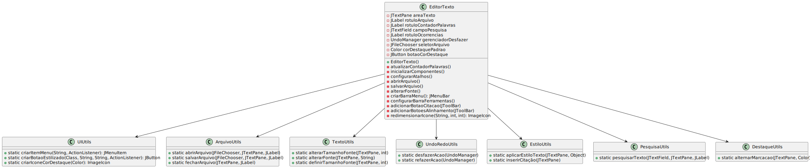

# Editor de Texto

## Descrição
Este projeto é um editor de texto simples, desenvolvido para demonstrar conceitos de POO (Programação Orientada a Objetos) e design de software. Ele permite ao usuário criar, editar e salvar arquivos de texto.

## Funcionalidades
- Criar novos documentos
- Abrir documentos existentes
- Editar texto
- Salvar alterações
- Interface intuitiva para interação do usuário

## Tecnologias Utilizadas
- Linguagem: Java
- Bibliotecas: Java Swing para interface gráfica

## Conceitos de POO Utilizados
Este projeto faz uso dos seguintes conceitos de Programação Orientada a Objetos:
- **Encapsulamento**: Proteção dos atributos e métodos internos das classes.
- **Herança**: Reutilização de código através de classes base e subclasses.
- **Polimorfismo**: Implementação de métodos que podem ser sobrescritos em classes derivadas.
- **Abstração**: Definição de classes genéricas que representam conceitos do editor de texto.

## Diagrama UML
O diagrama UML do projeto pode ser visualizado abaixo:



Para visualizar o diagrama diretamente, abra o arquivo `uml_diagram.svg` na pasta raiz do projeto.

## Como Executar
1. Clone este repositório:
   ```sh
   git clone https://github.com/seu-usuario/editor-texto.git
   ```
2. Navegue até o diretório do projeto:
   ```sh
   cd editor-texto
   ```
3. Compile o código Java:
   ```sh
   javac -d bin src/*.java
   ```
4. Execute o programa:
   ```sh
   java -cp bin Main
   ```