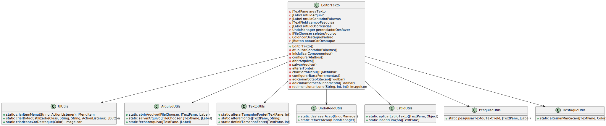

# Text Editor

## Description
This project is a simple text editor developed to demonstrate Object-Oriented Programming (OOP) concepts and software design for the course Object-Oriented Programming (UFSM00274). It allows users to create, edit, and save text files.

## Features
- Create new documents
- Open existing documents
- Edit text
- Save changes
- Intuitive user interface

## Technologies Used
- Language: Java
- Libraries: Java Swing for graphical interface

## OOP Concepts Used
This project applies the following Object-Oriented Programming concepts:
- **Encapsulation**: Protecting class attributes and internal methods.
- **Inheritance**: Code reuse through base and subclass relationships.
- **Polymorphism**: Implementation of methods that can be overridden in derived classes.
- **Abstraction**: Definition of generic classes representing text editor concepts.

## UML Diagram
The UML diagram of the project can be viewed below:



To view the diagram directly, open the `uml_diagram.svg` file in the project root folder.

## How to Run
1. Clone this repository:
   ```sh
   git clone https://github.com/your-username/Editor-De-Texto.git
   
2. Navigate to the project directory:
   ```sh
   cd Editor-De-Texto

3. Compile the Java code:
   ```sh
   javac -d bin src/*.java

4. Run the program:
   ```sh
   java -cp bin EditorTexto
